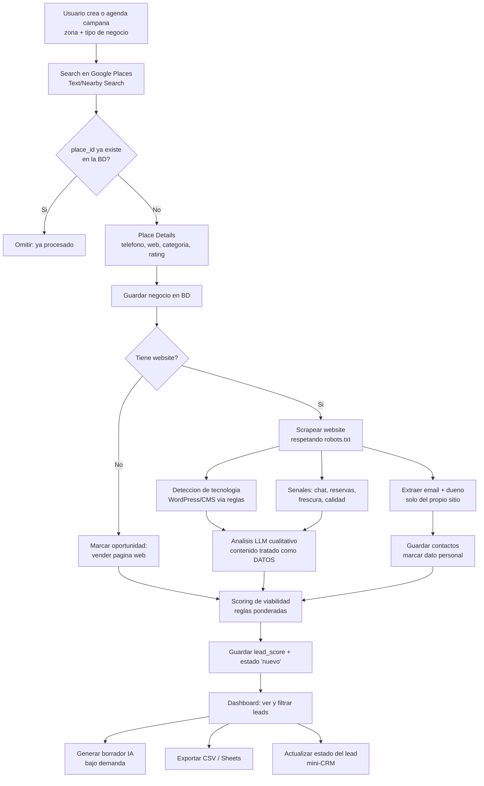

# Sistema de Generación de Leads — Plan del Proyecto

> Documento de diseño. Define el alcance, la arquitectura, el modelo de datos, el
> flujo de procesamiento, la seguridad y la hoja de ruta por fases.
> **Estado:** borrador para aprobación antes de crear `CLAUDE.md` y empezar a construir.

---

## 1. Objetivo

Construir una herramienta **privada** (uso interno, multiusuario con roles) que:

1. Busque negocios en zonas y categorías específicas usando la **API de Google Places**.
2. Enriquezca cada negocio con teléfono, sitio web, categoría, rating, etc.
3. Separe negocios **con** y **sin** website.
4. Para los que tienen web: la **scrapee** para detectar el CMS/tecnología (WordPress, etc.),
   señales de calidad, presencia de automatización (chat, reservas), y extraiga **email** y,
   en lo posible, el **nombre del propietario** (best-effort, solo desde el propio sitio).
5. **Puntúe la viabilidad** de cada lead como oportunidad de venta de servicios digitales.
6. Genere **borradores** de mensaje personalizados con IA (no envía nada automáticamente).
7. Lleve un **mini-CRM** con estados del lead y permita **exportar** (CSV/Excel, Google Sheets).
8. **Evite reprocesar** negocios ya vistos mediante un filtro por `google_place_id`.

---

## 2. Decisiones tomadas

| Tema | Decisión | Implicación técnica |
|------|----------|---------------------|
| Escala | Cientos de negocios | `BackgroundTasks` de FastAPI; sin Celery/Redis al inicio |
| Mercado | Mixto / global | Agnóstico de idioma; `phonenumbers`; cumplimiento GDPR por defecto |
| Frontend | HTMX + Jinja2 | Una sola pila (Python); servido por FastAPI |
| Motor de análisis | Híbrido | Detección por reglas + LLM solo para lo cualitativo |
| Acceso | Multiusuario con roles | Auth + RBAC (admin / vendedor) |
| Proveedor LLM | Decidir después | Capa de abstracción intercambiable |
| Scoring (criterios) | Sin web, web obsoleta, buen rating/volumen, sin automatización | Puntuación ponderada y configurable |
| Búsqueda de dueño | Solo desde el propio website | Bajo riesgo legal; best-effort |
| Disparador de búsqueda | Manual + programado | Campañas con ejecución manual o agendada |
| Contacto | Generar borradores con IA (no envía) | Sin gestión de envío/deliverability en v1 |
| Seguimiento | Estados básicos (mini-CRM) | Estado por lead + asignación |
| Exportar | CSV/Excel, Google Sheets, dashboard | Exportadores desacoplados |

---

## 3. Realidades técnicas que moldean el diseño

- **Google Places NO devuelve email ni dueño.** Devuelve nombre, dirección, teléfono,
  website, categoría, rating, horarios y coordenadas. El **email** y el **dueño** salen del
  scraping del propio website. Por eso el scraping es un paso central, no opcional.
- **Costo y ToS de Google.** Se cobra por petición; usaremos *field masks* para limitar
  campos y costo. El `place_id` **sí** se puede almacenar de forma permanente (es nuestra
  clave de deduplicación); otros campos tienen restricciones de caché que respetaremos.
- **Privacidad (GDPR).** Email y nombre del dueño son datos personales. El diseño debe
  permitir **borrar/anonimizar** y registrar el origen de cada dato.
- **Scraping responsable.** Respetar `robots.txt`, limitar concurrencia, identificar el
  User-Agent y aplicar back-off. Solo páginas públicas del propio negocio.

---

## 4. Arquitectura (alto nivel)

```
                 Navegador (HTMX + Jinja2)
                          │ HTTP
                          ▼
        ┌─────────────────────────────────────┐
        │             FastAPI                  │
        │  ┌───────────┐   ┌────────────────┐  │
        │  │  Rutas/UI │   │  Auth + RBAC   │  │
        │  └─────┬─────┘   └────────────────┘  │
        │        │                              │
        │  ┌─────▼───────────────────────────┐ │
        │  │  Features (router→service→repo) │ │
        │  │  Pipeline · Integrations · Web  │ │
        │  │  (scrape, scoring, llm, export) │ │
        │  └─────┬───────────────────────────┘ │
        │        │  BackgroundTasks             │
        └────────┼──────────────────────────────┘
                 │
        ┌────────▼────────┐     ┌──────────────────┐
        │   PostgreSQL    │     │  Servicios ext.  │
        │ (SQLAlchemy +   │     │  Google Places   │
        │   Alembic)      │     │  LLM (abstraído) │
        └─────────────────┘     │  Websites (scrap)│
                                 └──────────────────┘
```

### Pila tecnológica propuesta

| Capa | Tecnología | Por qué |
|------|------------|---------|
| Web framework | **FastAPI** | Pedido; async, validación con Pydantic |
| Plantillas/UI | **Jinja2 + HTMX** | Aprendizaje en una sola pila |
| ORM / migraciones | **SQLAlchemy (async) + Alembic** | Consultas seguras (anti-inyección SQL) + versionado de esquema |
| Base de datos | **PostgreSQL** | Pedido; JSONB para señales flexibles |
| Tareas en 2º plano | **FastAPI BackgroundTasks** (luego Arq/Celery) | Suficiente para cientos; fácil de aprender |
| HTTP cliente | **httpx** | Async, para API y scraping |
| Parsing HTML | **selectolax / BeautifulSoup** | Extraer señales del HTML |
| Detección de tech | **reglas + python-Wappalyzer** | Detectar WordPress/CMS por headers y HTML |
| Teléfonos | **phonenumbers** | Normalizar formatos internacionales |
| Rate limiting | **slowapi** | Limitar peticiones por usuario/IP |
| Hash de contraseñas | **passlib (bcrypt)** | Seguridad de credenciales |
| Auth | **JWT o sesión + cookie segura** | Acceso privado con roles |
| LLM | **Adaptador `integrations/llm/`** | Cambiar proveedor sin tocar la lógica de negocio |
| Config/secretos | **pydantic-settings + .env** | Secretos fuera del repo |

---

## 5. Modelo de datos (esquema inicial)

> Clave de deduplicación: `businesses.google_place_id` con índice **UNIQUE**.

- **users** — `id, email (unique), hashed_password, role (admin|vendedor), is_active, created_at`
- **campaigns** — `id, name, area_text, business_type, params (jsonb), schedule (cron|null), created_by, created_at`
- **search_runs** — `id, campaign_id, status (pending|running|done|error), started_at, finished_at, results_count, new_count, api_cost_est, error`
- **businesses** — `id, google_place_id (UNIQUE), name, category, phone_raw, phone_e164, website_url, has_website (bool), address, lat, lng, rating, reviews_count, first_seen_run_id, created_at, updated_at`
- **website_analyses** — `id, business_id (fk), reachable (bool), cms_detected, tech_stack (jsonb), has_chat (bool), has_booking (bool), freshness_signal, quality_score, raw_signals (jsonb), analyzed_at`
- **contacts** — `id, business_id (fk), name, role, email, phone, source (enum), confidence (0-1), is_personal_data (bool), created_at`
- **lead_scores** — `id, business_id (fk), score (0-100), breakdown (jsonb), model_version, computed_at`
- **lead_status** — `id, business_id (fk, unique), status (nuevo|contactado|interesado|descartado|cliente), assigned_to (fk users), notes, updated_at`
- **message_drafts** — `id, business_id (fk), channel (email|...), subject, body, model_used, created_by, created_at`

> El **filtro anti-reproceso** se resuelve con: `INSERT ... ON CONFLICT (google_place_id) DO NOTHING`
> y, opcionalmente, una política de "no re-scrapear si `analyzed_at` < N días".

---

## 6. Flujo de procesamiento (pipeline)



### Detalle de etapas

1. **Search** — `Text Search`/`Nearby Search` con paginación; recoge `place_id`s.
2. **Dedup** — descartar `place_id`s ya presentes (filtro anti-reproceso).
3. **Details** — `Place Details` con *field mask* mínima para controlar costo.
4. **Split** — `has_website = website_url IS NOT NULL`.
5. **Scrape** (solo con web) — descarga HTML público; back-off y `robots.txt`.
6. **Tech detect** — reglas + Wappalyzer (CMS, framework, plugins visibles).
7. **Extract** — email (`mailto:`, página contacto) y dueño (Sobre nosotros/equipo).
8. **Signals** — chat widget, reservas online, fecha/frescura, calidad básica.
9. **LLM cualitativo** — resumen/clasificación; **contenido scrapeado = datos no confiables**.
10. **Scoring** — ver §7.
11. **Draft** — mensaje personalizado (bajo demanda, no envía).
12. **CRM/Export** — estado del lead y exportación.

---

## 7. Sistema de puntuación (viabilidad)

Puntaje **0–100**, ponderado y configurable. Componentes iniciales:

| Señal | Lógica | Peso (ej.) |
|-------|--------|-----------|
| No tiene website | Oportunidad clara de venderle web | +35 |
| Web obsoleta/mala | CMS antiguo, sin HTTPS, lenta, poca frescura | +25 |
| Buen rating/volumen | rating alto y muchas reseñas → tiene dinero e imagen | +25 |
| Sin automatización visible | sin chat ni reservas online | +15 |

> Los pesos se guardan en configuración para poder afinarlos sin tocar el código.
> El `breakdown` (jsonb) explica *por qué* cada lead obtuvo su puntaje (transparencia).

---

## 8. Seguridad

### 8.1 Inyección de prompts (LLM)
- El contenido scrapeado se trata **siempre como datos, nunca como instrucciones**.
- Separación clara en el prompt (delimitadores) entre instrucciones del sistema y contenido externo.
- **Salida estructurada validada** (esquema/Pydantic); ignorar cualquier "instrucción" del texto.
- Truncar/limitar el contenido enviado; no reenviar enlaces o comandos del sitio.

### 8.2 Base de datos
- **SQLAlchemy ORM** (consultas parametrizadas) — sin SQL crudo concatenado.
- Usuario de BD con **privilegios mínimos** (no superusuario).
- Conexión por TLS; **backups** automáticos; secretos en `.env` (fuera del repo).

### 8.3 Autenticación y acceso
- Contraseñas con **bcrypt**; **RBAC** (admin/vendedor).
- **HTTPS** obligatorio; cookies `Secure`+`HttpOnly`+`SameSite`.
- Acceso privado: además, restricción opcional por **IP/VPN** en el VPS.

### 8.4 Rate limiting y abuso
- **slowapi** por usuario/IP en endpoints sensibles.
- Límite de **peticiones salientes** a Google (control de costo) y scraping educado.

### 8.5 VPS / despliegue
- Reverse proxy (**Caddy/Nginx**) con HTTPS (Let's Encrypt).
- Firewall (solo 80/443/SSH), `fail2ban`, SSH por clave.
- Variables de entorno gestionadas fuera del repositorio.

### 8.6 Cumplimiento (GDPR)
- Registrar **origen** de cada dato personal; permitir **borrado/anonimización**.
- Respetar ToS de Google (qué se cachea y por cuánto).
- Respetar `robots.txt` y límites de scraping.

---

## 9. Hoja de ruta por fases (orientada a aprender)

> Cada fase es funcional por sí sola; aprendes una pieza a la vez.

- **Fase 0 — Cimientos.** Estructura del repo, entorno, Postgres, esqueleto FastAPI,
  configuración (`.env`), auth básica + roles.
- **Fase 1 — Google Places + BD.** Integración de búsqueda, tabla `businesses`,
  deduplicación por `place_id`, UI manual de búsqueda.
- **Fase 2 — Split + scoring por reglas.** Con/sin web; primer puntaje (sin scraping aún).
- **Fase 3 — Scraping + extracción.** Tech detect (WordPress/CMS), email y dueño, señales.
- **Fase 4 — Capa LLM híbrida.** Análisis cualitativo + generación de borradores.
- **Fase 5 — Mini-CRM + export.** Estados de lead, asignación, CSV/Excel/Sheets.
- **Fase 6 — Campañas programadas + hardening + despliegue VPS.**

---

## 10. Estructura de carpetas (por dominio + capas)

Organización **por dominio** (alta cohesión) con servicios externos aislados detrás de
**adaptadores** (bajo acoplamiento), y una **arquitectura en 4 capas** dentro de cada feature
para que cada archivo tenga una sola responsabilidad — esencial para mantener y escalar.

### Las 4 capas (qué hace qué)

```
Petición HTTP
   │
   ▼  router.py      → habla HTTP: recibe, valida con schemas, llama al service. Nada más.
   ▼  service.py     → lógica de negocio (las reglas). No sabe de HTTP ni de SQL.
   ▼  repository.py  → habla con la BD: consultas (SELECT/INSERT). Sin reglas de negocio.
   ▼  models.py      → la tabla en PostgreSQL.
```

### Árbol

```
backend/
├── app/
│   ├── main.py                 # app factory: create_app(), middleware, registro de routers
│   ├── core/                   # INFRAESTRUCTURA transversal (sin lógica de negocio)
│   │   ├── config.py           # Settings (pydantic-settings) — TODA la config sale del .env
│   │   ├── constants.py        # enums/constantes globales (estados de lead, roles...)
│   │   ├── database.py         # engine async, session factory, Base
│   │   ├── dependencies.py     # deps compartidas (get_session, paginación)
│   │   ├── security.py         # hashing de contraseñas, tokens
│   │   ├── rate_limit.py       # configuración de slowapi
│   │   ├── logging.py          # configuración de logs
│   │   └── exceptions.py       # excepciones base + handlers globales
│   │
│   ├── features/               # DOMINIOS de usuario — cada uno con el mismo molde de 8 archivos:
│   │   │                       #   router · schemas · service · repository · models
│   │   │                       #   dependencies · constants · exceptions
│   │   ├── auth/               # usuarios, login, RBAC (admin/vendedor)
│   │   ├── campaigns/          # campañas + search_runs
│   │   ├── businesses/         # entidad negocio + dedup por google_place_id
│   │   ├── leads/              # scoring + estados mini-CRM
│   │   └── drafts/             # borradores de mensaje IA
│   │
│   ├── pipeline/               # ETAPAS de procesamiento de un search_run
│   │   ├── orchestrator.py     # corre el pipeline completo (único que conoce el orden)
│   │   ├── places.py           # search + details (usa integrations.google)
│   │   ├── scraper.py          # fetch web (robots.txt, back-off, timeouts)
│   │   ├── tech_detect.py      # detección CMS/tecnología
│   │   ├── extract.py          # extracción email + dueño (solo del propio sitio)
│   │   ├── scoring.py          # viabilidad (pesos vienen de config, NO hardcode)
│   │   └── constants.py
│   │
│   ├── integrations/           # ADAPTADORES de servicios externos (intercambiables)
│   │   ├── google/             # cliente Google Places (field masks, control de costo)
│   │   ├── llm/                # capa LLM agnóstica: base.py (interfaz) · client.py (factory) · prompts.py
│   │   └── sheets/             # exportación a Google Sheets
│   │
│   ├── export/                 # exportadores CSV/Excel (no externos)
│   ├── jobs/                   # (reservada) tareas programadas — Fase 6
│   ├── web/                    # presentación: routes HTMX + templates/ (por feature) + static/
│   └── shared/                 # helpers mínimos entre dominios (phones, texto)
│
├── alembic/                    # migraciones
├── tests/                      # espeja la estructura de app/
├── scripts/                    # scripts puntuales (crear admin, seeds)
├── .env.example                # plantilla (SÍ se versiona)
├── .env                        # secretos reales (NO se versiona)
├── pyproject.toml
├── PLAN.md                     # este documento
└── CLAUDE.md                   # guía de desarrollo
```

---

## 11. Preguntas abiertas / decisiones pendientes

- Proveedor LLM concreto (se decidirá; la capa de abstracción lo permite).
- ¿Usar Playwright para sitios que cargan contenido con JS? (añadir solo si hace falta).
- Política exacta de re-scraping (¿cada cuántos días se revisa un negocio ya visto?).
- Diseño visual del dashboard (se define al llegar a la UI).

---

## 12. Próximos pasos

1. **Revisar y aprobar este plan** (o ajustar lo que haga falta).
2. Crear el **`CLAUDE.md`** con convenciones, comandos y contexto del proyecto.
3. Comenzar por la **Fase 0** (cimientos).
```
